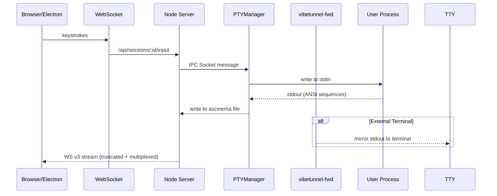

# VibeTunnel Architecture Analysis - Mario's Technical Deep Dive

This document contains comprehensive technical insights from Mario's debugging session about VibeTunnel's architecture, critical performance issues, and detailed solutions.

## Executive Summary

Mario identified two critical issues causing performance problems in VibeTunnel:

1. **850MB Session Bug**: External terminal sessions (via `vibetunnel-fwd`) bypass the clear sequence truncation in `stream-watcher.ts`, sending entire gigabyte files instead of the last 2MB
2. **Resize Loop**: Claude terminal app issues full clear sequence (`\x1b[2J`) and re-renders entire scroll buffer on every resize event, creating exponential data growth

Note: A third issue with Node-PTY's shared pipe architecture causing Electron crashes has already been resolved with a custom PTY implementation.

## System Architecture

### Core Components

```
┌─────────────┐     ┌──────────────┐     ┌─────────────┐
│   Client    │────▶│  Web Server  │────▶│ PTY Process │
└─────────────┘     └──────────────┘     └─────────────┘
      │                    │                     │
      │                    ▼                     ▼
      │              ┌──────────┐         ┌──────────┐
      └─────────────▶│ Terminal │         │ Ascinema │
                     │ Manager  │         │  Files   │
                     └──────────┘         └──────────┘
```

### Detailed Sequence Flow



### Key Files and Their Roles

| File | Purpose | Critical Functions |
|------|---------|-------------------|
| `server.ts` | Main web server | HTTP endpoints, WebSocket handling |
| `pty-manager.ts` | PTY lifecycle management | `createSession()`, `setupPtyHandlers()` |
| `stream-watcher.ts` | Monitors ascinema files | `sendExistingContent()` - implements clear truncation |
| `vibetunnel-fwd` | External terminal forwarding | Process spawning, **BYPASSES TRUNCATION** |
| `terminal-manager.ts` | Binary buffer rendering | Converts ANSI to binary cells format |

### Data Flow Paths

#### Input Path (Keystroke → Terminal)
1. Browser captures key press
2. WebSocket v3 sends to `/ws` (`INPUT_TEXT`/`INPUT_KEY`/`RESIZE`)
3. Server writes to IPC socket
4. PTY Manager writes to process stdin
5. Process executes command

#### Output Path (Terminal → Browser)
1. Process writes to stdout
2. PTY Manager captures via `onData` handler
3. Writes to asciinema cast file (with write queue for backpressure)
4. CastOutputHub tails file + scans for last clear sequence (pruning)
5. Client receives via `/ws` v3:
   - `STDOUT` (UTF-8 bytes)
   - `SNAPSHOT_VT` (server-rendered VT snapshot bytes)

### Binary Cell Buffer Format

The terminal manager pre-renders terminal output into a binary format for efficient transmission:

```
For each cell at (row, column):
- Character (UTF-8 encoded)
- Foreground color (RGB values)
- Background color (RGB values)
- Attributes (bold, italic, underline, etc.)
```

Benefits:
- Server-side ANSI parsing eliminates client CPU usage
- Efficient binary transmission reduces bandwidth
- Only last 10,000 lines kept in memory
- Client simply renders pre-computed cells

## Critical Bugs Analysis

### 1. The 850MB Session Loading Bug

**Symptom**: Sessions with large output (850MB+) cause infinite loading and browser unresponsiveness.

**Root Cause**: External terminal sessions via `vibetunnel-fwd` bypass the clear sequence truncation logic.

**Technical Details**:
```javascript
// In stream-watcher.ts - WORKING CORRECTLY
sendExistingContent() {
  // Scans backwards for last clear sequence
  const lastClear = content.lastIndexOf('\x1b[2J');
  // Sends only content after clear
  return content.slice(lastClear); // 2MB instead of 850MB
}
```

**Evidence from Testing**:
- Test file: 980MB containing 2,400 clear sequences
- Server-created sessions: Correctly send only last 2MB
- External terminal sessions: Send entire 980MB file
- Processing time: 2-3 seconds to scan 1GB file
- Client receives instant replay for 2MB truncated content

**The Issue**: External terminal path doesn't trigger `sendExistingContent()`, sending gigabyte files to clients.

### 2. Resize Event Performance Catastrophe

**Problem**: Each resize event causes Claude to re-render the entire terminal history.

**Claude's Behavior**:
```
1. Resize event received
2. Claude issues clear sequence: \x1b[2J
3. Re-renders ENTIRE scroll buffer from line 1
4. Rendering causes viewport changes
5. Viewport changes trigger resize event
6. GOTO step 1 (infinite loop)
```

**Technical Evidence**:
- In 850MB session: each resize → full buffer re-render
- Claude renders from "Welcome to Claude" message every time
- Mobile UI particularly problematic (frequent resize events)
- Header button position shifts during rendering indicate viewport instability
- Session with 39 resize events can generate 850MB+ files

**Contributing Factors**:
- React Ink (TUI framework) unnecessarily re-renders entire components
- Session-detail-view has buggy resize observer
- Mobile Safari behaves differently than desktop at same viewport size
- Touch events vs mouse events complicate scrolling behavior

### 3. Node-PTY Architecture Flaw (ALREADY FIXED)

This issue has been resolved by implementing a custom PTY solution without the shared pipe architecture.

## Ascinema Format Details

VibeTunnel uses the ascinema format for recording terminal sessions:

```javascript
// Format: [timestamp, event_type, data]
[1.234, "o", "Hello World\n"]     // Output event
[1.235, "i", "k"]                 // Input event (keypress)
[1.236, "r", "80x24"]             // Resize event
```

Clear sequence detection:
```javascript
const CLEAR_SEQUENCE = '\x1b[2J';  // ANSI clear screen
const CLEAR_WITH_HOME = '\x1b[H\x1b[2J'; // Home + clear

function findLastClearSequence(buffer) {
    // Search from end for efficiency
    let lastClear = buffer.lastIndexOf(CLEAR_SEQUENCE);
    return lastClear === -1 ? 0 : lastClear;
}
```

## Proposed Solutions

### Priority 1: Fix External Terminal Clear Truncation (IMMEDIATE)

**Problem**: External terminal sessions don't use `sendExistingContent()` truncation.

**Investigation Needed**:
1. Trace how `vibetunnel-fwd` connects to client streams
2. Determine why it bypasses stream-watcher's truncation
3. Ensure external terminals use same code path as server sessions
4. Test with 980MB file to verify fix

**Expected Impact**: Immediate fix for users experiencing infinite loading with large sessions.

### Priority 2: Fix Resize Handling (INVESTIGATION)

**Debugging Approach**:
1. Instrument session-detail-view with resize observer logging
2. Identify what causes viewport expansion
3. Implement resize event debouncing
4. Fix mobile-specific issues:
   - Keyboard state affects scrolling
   - Touch vs mouse event handling
   - Scrollbar visibility problems

**Code to Add**:
```javascript
// Add to session-detail-view
let resizeCount = 0;
new ResizeObserver((entries) => {
    console.log(`Resize ${++resizeCount}:`, entries[0].contentRect);
    // Debounce resize events
    clearTimeout(this.resizeTimeout);
    this.resizeTimeout = setTimeout(() => {
        this.handleResize();
    }, 100);
}).observe(this.terminalElement);
```

## Implementation Details

### Write Queue Implementation

The PTY manager implements backpressure handling:

```javascript
class WriteQueue {
    constructor(writer) {
        this.queue = [];
        this.writing = false;
        this.writer = writer;
    }
    
    async write(data) {
        this.queue.push(data);
        if (!this.writing) {
            await this.flush();
        }
    }
    
    async flush() {
        this.writing = true;
        while (this.queue.length > 0) {
            const chunk = this.queue.shift();
            await this.writer.write(chunk);
        }
        this.writing = false;
    }
}
```

### Platform-Specific Considerations

**macOS**:
- Screen Recording permission required for terminal access
- Terminal.app specific behaviors and quirks

**Mobile Safari**:
- Different behavior than desktop Safari at same viewport
- Touch events complicate scrolling
- Keyboard state affects scroll behavior
- Missing/hidden scrollbars
- Viewport meta tag issues

**Windows (Future)**:
- ConPTY vs WinPTY support
- Different ANSI sequence handling
- Path normalization requirements

## Performance Metrics

| Metric | Current | After Fix |
|--------|---------|-----------|
| 980MB session initial load | Infinite/Crash | 2-3 seconds |
| Data sent to client | 980MB | 2MB |
| Memory per terminal | 50-100MB | Target: 10MB |
| Clear sequence scan time | N/A | ~2 seconds for 1GB |
| Resize event storms | Exponential growth | Debounced |

## Testing and Debugging

### Test Large Session Handling
```bash
# Create large session file
cd web
npm run dev

# In another terminal, create session
SESSION_ID=$(curl -X POST localhost:3000/api/sessions | jq -r .id)

# Stop server, inject large file
cp /path/to/850mb-test-file ~/.vibetunnel/sessions/$SESSION_ID/stdout

# Restart and verify truncation works
npm run dev
```

### Debug Resize Events
```javascript
// Add to any component to detect resize loops
window.addEventListener('resize', () => {
    console.count('resize');
    console.trace('Resize triggered from:');
});
```

### Monitor Network Traffic
- Check `/ws` traffic (v3 frames) for `STDOUT` and `SNAPSHOT_VT`
- Verify pruning works (no replay before last clear)
- Use `/api/sessions/:id/snapshot` for snapshot/export debugging

## Architectural Insights

### Why Current Architecture Works (When Not Bugged)

1. **Simplicity**: "Es ist die todeleinfachste Variante" - It's the simplest possible approach
2. **Efficiency**: 2MB instead of 980MB transmission after clear sequence truncation
3. **Server-side rendering**: Binary cell format eliminates client ANSI parsing

### Community Contribution Challenges

- High development velocity makes contribution difficult
- "Velocity kills" - rapid changes discourage contributors
- LitElement/Web Components unfamiliar to most developers
- Large file sizes cause AI tools to refuse processing

### Future Architecture Considerations

**Go Migration Benefits**:
- Automatic test dependency tracking
- Only runs tests that changed
- Pre-allocated buffers minimize GC
- Better suited for AI-assisted development

**Rust Benefits**:
- 2MB static binary
- 10MB RAM usage
- Direct C interop for PTY code
- No garbage collection overhead

## Action Plan Summary

1. **Immediate (End of Week)**: Fix external terminal truncation bug
   - Debug why `vibetunnel-fwd` bypasses `sendExistingContent()`
   - Deploy fix for immediate user relief

2. **Short Term**: Comprehensive resize fix
   - Debug session-detail-view triggers
   - Implement proper debouncing
   - Fix mobile-specific issues

3. **Long Term**: Consider architecture migration
   - Evaluate Rust forward binary
   - Consider Go for web server
   - Maintain backwards compatibility

## Key Technical Quotes

- "Wir schicken 2MB statt 980MB" - We send 2MB instead of 980MB
- "Die haben einen Shared Pipe, wo alle reinschreiben" - They have a shared pipe where everyone writes
- "Es gibt keinen Grund, warum ich von da weg alles neu rendern muss" - There's no reason to re-render everything from the beginning
- "Das ist known good" - Referring to battle-tested implementations

This architecture analysis provides the technical foundation for fixing VibeTunnel's critical performance issues while maintaining its elegant simplicity.
